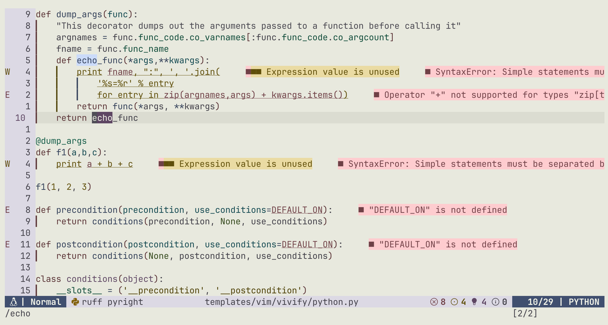
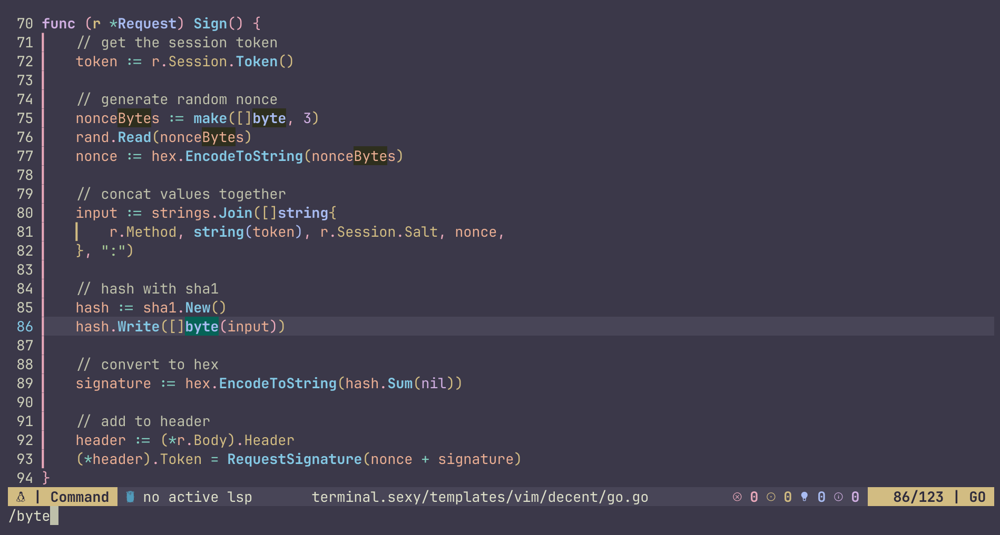

# Mytilus

Mytilus is a theme inspired by the shell of Mytilus edulis, the blue mussel.
Created using the OKLCH color space,
this theme meets AA contrast standards

|mytilus-light|mytilus-dark|
|---|---|
|||

## Install
		
- lazy.nvim

```lua
{
  "racagogi/mytilus",
  lazy = false,
  priority = 1000,
  opts = {},
}
```
## Usage
		
```lua
vim.cmd[[colorscheme mytilus]] -- default is light
vim.cmd[[colorscheme mytilus-light]]
vim.cmd[[colorscheme mytilus-dark]]
```

## Config	
			
```lua
config = function()
	require("mytilus").setup(
		{
			theme = 'light' -- light or dark
			options = {  -- add or remove attrs
				clear = {},
				bold = { ["sy.type"] = true, ["sy.keyword"] = true },
				undercurl = {},
				underline = {},
				underdashed = {},
				underdotted = {},
				underdouble = {},
				strikethrough = {},
				italic = { ["sy.string"] = true }
			}
			overides = { 
				Normal = { bg = nil } -- overide highlight groups directly
			}
		}
	)
	vim.cmd [[colorscheme mytilus-dark]] -- colorscheme takes precedence over theme
end
```
<details>

## light colors

| | hex | rgb | OKlab |
|---|---|---|
| d0_black | #202924 | [0.13, 0.16, 0.14] |  [0.27, -0.01, 0.01] |
| d0_white | #2C2429 | [0.17, 0.14, 0.16] |  [0.27, 0.01, -0.01] |
| d1_black | #2A332E | [0.16, 0.2, 0.18] |  [0.31, -0.01, 0.01] |
| d1_white | #362D33 | [0.21, 0.18, 0.2] |  [0.31, 0.01, -0.01] |
| d2_black | #343D38 | [0.2, 0.24, 0.22] |  [0.35, -0.01, 0.01] |
| d2_white | #40383D | [0.25, 0.22, 0.24] |  [0.35, 0.01, -0.01] |
| d3_black | #3E4842 | [0.24, 0.28, 0.26] |  [0.39, -0.01, 0.01] |
| d3_white | #4B4247 | [0.29, 0.26, 0.28] |  [0.39, 0.01, -0.01] |
| d1_red | #551234 | [0.33, 0.07, 0.21] |  [0.31, 0.1, -0.01] |
| d1_orange | #551818 | [0.33, 0.1, 0.09] |  [0.31, 0.08, 0.04] |
| d1_yellow | #482705 | [0.28, 0.15, 0.02] |  [0.31, 0.03, 0.06] |
| d1_chartreuse | #30331A | [0.19, 0.2, 0.1] |  [0.31, -0.02, 0.04] |
| d1_green | #153637 | [0.08, 0.21, 0.22] |  [0.31, -0.04, -0.01] |
| d1_cyan | #183150 | [0.1, 0.19, 0.31] |  [0.31, -0.02, -0.06] |
| d1_blue | #322659 | [0.2, 0.15, 0.35] |  [0.31, 0.03, -0.08] |
| d1_purple | #48194D | [0.28, 0.1, 0.3] |  [0.31, 0.08, -0.06] |
| d3_red | #742049 | [0.45, 0.13, 0.29] |  [0.39, 0.12, -0.01] |
| d3_orange | #752821 | [0.46, 0.16, 0.13] |  [0.39, 0.1, 0.05] |
| d3_yellow | #633B02 | [0.39, 0.23, 0.01] |  [0.39, 0.03, 0.08] |
| d3_chartreuse | #404A23 | [0.25, 0.29, 0.14] |  [0.39, -0.03, 0.05] |
| d3_green | #154F4D | [0.08, 0.31, 0.3] |  [0.39, -0.06, -0.01] |
| d3_cyan | #1B486E | [0.11, 0.28, 0.43] |  [0.39, -0.03, -0.08] |
| d3_blue | #43397A | [0.26, 0.22, 0.48] |  [0.39, 0.03, -0.1] |
| d3_purple | #62296B | [0.38, 0.16, 0.42] |  [0.39, 0.1, -0.08] |
| v0_black | #CEE9D9 | [0.81, 0.91, 0.85] |  [0.91, -0.03, 0.01] |
| v0_white | #F2D9E9 | [0.95, 0.85, 0.91] |  [0.91, 0.03, -0.01] |
| v1_black | #C1DCCC | [0.76, 0.86, 0.8] |  [0.87, -0.03, 0.01] |
| v1_white | #E5CCDB | [0.9, 0.8, 0.86] |  [0.87, 0.03, -0.01] |
| v2_black | #B5CFC0 | [0.71, 0.81, 0.75] |  [0.83, -0.03, 0.01] |
| v2_white | #D8BFCE | [0.85, 0.75, 0.81] |  [0.83, 0.03, -0.01] |
| v3_black | #A8C2B3 | [0.66, 0.76, 0.7] |  [0.79, -0.03, 0.01] |
| v3_white | #CBB2C2 | [0.8, 0.7, 0.76] |  [0.79, 0.03, -0.01] |
| v2_red | #FDABCD | [0.99, 0.67, 0.8] |  [0.83, 0.1, -0.01] |
| v2_orange | #FDB1AA | [0.99, 0.69, 0.67] |  [0.83, 0.08, 0.04] |
| v2_yellow | #E8BE9C | [0.91, 0.74, 0.61] |  [0.83, 0.03, 0.06] |
| v2_chartreuse | #C7CBAD | [0.78, 0.8, 0.68] |  [0.83, -0.02, 0.04] |
| v2_green | #ABD0D0 | [0.67, 0.81, 0.82] |  [0.83, -0.04, -0.01] |
| v2_cyan | #ACCAF1 | [0.67, 0.79, 0.94] |  [0.83, -0.02, -0.06] |
| v2_blue | #C8BDFD | [0.78, 0.74, 0.99] |  [0.83, 0.03, -0.08] |
| v2_purple | #E8B1EE | [0.91, 0.69, 0.93] |  [0.83, 0.08, -0.06] |


### contrast

| | v0_black | v0_white | v1_black | v1_white | v2_black | v2_white |
|---|---|---|---|---|---|---|
| d0_black | AAA | AAA | AAA | AAA | AAA | AAA |
| d0_white | AAA | AAA | AAA | AAA | AAA | AAA |
| d1_black | AAA | AAA | AAA | AAA | AAA | AAA |
| d1_white | AAA | AAA | AAA | AAA | AAA | AAA |
| d2_black | AAA | AAA | AAA | AAA | AA | AA |
| d2_white | AAA | AAA | AAA | AAA | AA | AA |
| d3_black | AAA | AAA | AA | AA | AA | AA |
| d3_white | AAA | AAA | AA | AA | AA | AA |
| d1_red | AAA | AAA | AAA | AAA | AAA | AAA |
| d1_orange | AAA | AAA | AAA | AAA | AAA | AAA |
| d1_yellow | AAA | AAA | AAA | AAA | AAA | AAA |
| d1_chartreuse | AAA | AAA | AAA | AAA | AAA | AAA |
| d1_green | AAA | AAA | AAA | AAA | AAA | AAA |
| d1_cyan | AAA | AAA | AAA | AAA | AAA | AAA |
| d1_blue | AAA | AAA | AAA | AAA | AAA | AAA |
| d1_purple | AAA | AAA | AAA | AAA | AAA | AAA |
| d3_red | AAA | AAA | AAA | AA | AA | AA |
| d3_orange | AAA | AAA | AA | AA | AA | AA |
| d3_yellow | AAA | AAA | AA | AA | AA | AA |
| d3_chartreuse | AAA | AAA | AA | AA | AA | AA |
| d3_green | AAA | AAA | AA | AA | AA | AA |
| d3_cyan | AAA | AAA | AA | AA | AA | AA |
| d3_blue | AAA | AAA | AA | AA | AA | AA |
| d3_purple | AAA | AAA | AA | AA | AA | AA |


| | v3_black | v3_white | v2_red | v2_orange | v2_yellow | v2_chartreuse | v2_green | v2_cyan | v2_blue | v2_purple |
|---|---|---|---|---|---|---|---|---|---|---|
| d0_black | AAA | AAA | AAA | AAA | AAA | AAA | AAA | AAA | AAA | AAA |
| d0_white | AAA | AAA | AAA | AAA | AAA | AAA | AAA | AAA | AAA | AAA |
| d1_black | AA | AA | AAA | AAA | AAA | AAA | AAA | AAA | AAA | AAA |
| d1_white | AA | AA | AAA | AAA | AAA | AAA | AAA | AAA | AAA | AAA |
| d2_black | AA | AA | AA | AA | AA | AA | AA | AA | AA | AA |
| d2_white | AA | AA | AA | AA | AA | AA | AA | AA | AA | AA |
| d3_black | AA | AA | AA | AA | AA | AA | AA | AA | AA | AA |
| d3_white | AA | AA | AA | AA | AA | AA | AA | AA | AA | AA |
| d1_red | AAA | AAA | AAA | AAA | AAA | AAA | AAA | AAA | AAA | AAA |
| d1_orange | AAA | AA | AAA | AAA | AAA | AAA | AAA | AAA | AAA | AAA |
| d1_yellow | AAA | AA | AAA | AAA | AAA | AAA | AAA | AAA | AAA | AAA |
| d1_chartreuse | AA | AA | AAA | AAA | AAA | AAA | AAA | AAA | AAA | AAA |
| d1_green | AA | AA | AAA | AAA | AAA | AAA | AAA | AAA | AAA | AAA |
| d1_cyan | AA | AA | AAA | AAA | AAA | AAA | AAA | AAA | AAA | AAA |
| d1_blue | AAA | AA | AAA | AAA | AAA | AAA | AAA | AAA | AAA | AAA |
| d1_purple | AAA | AAA | AAA | AAA | AAA | AAA | AAA | AAA | AAA | AAA |
| d3_red | AA | AA | AA | AA | AA | AA | AA | AA | AA | AA |
| d3_orange | AA | AA | AA | AA | AA | AA | AA | AA | AA | AA |
| d3_yellow | AA | AA | AA | AA | AA | AA | AA | AA | AA | AA |
| d3_chartreuse | AA | AA | AA | AA | AA | AA | AA | AA | AA | AA |
| d3_green | AA | AA | AA | AA | AA | AA | AA | AA | AA | AA |
| d3_cyan | AA | AA | AA | AA | AA | AA | AA | AA | AA | AA |
| d3_blue | AA | AA | AA | AA | AA | AA | AA | AA | AA | AA |
| d3_purple | AA | AA | AA | AA | AA | AA | AA | AA | AA | AA |


## dark colors

| | hex | rgb | OKlab |
|---|---|---|
| d0_black | #CCD7D1 | [0.8, 0.84, 0.82] |  [0.87, -0.01, 0.01] |
| d0_white | #DBD1D7 | [0.86, 0.82, 0.84] |  [0.87, 0.01, -0.01] |
| d1_black | #BFCAC4 | [0.75, 0.79, 0.77] |  [0.83, -0.01, 0.01] |
| d1_white | #CEC4CA | [0.81, 0.77, 0.79] |  [0.83, 0.01, -0.01] |
| d2_black | #B3BEB7 | [0.7, 0.74, 0.72] |  [0.79, -0.01, 0.01] |
| d2_white | #C2B7BD | [0.76, 0.72, 0.74] |  [0.79, 0.01, -0.01] |
| d3_black | #A6B1AB | [0.65, 0.69, 0.67] |  [0.75, -0.01, 0.01] |
| d3_white | #B5AAB1 | [0.71, 0.67, 0.69] |  [0.75, 0.01, -0.01] |
| d1_red | #FDABCD | [0.99, 0.67, 0.8] |  [0.83, 0.1, -0.01] |
| d1_orange | #FDB1AA | [0.99, 0.69, 0.67] |  [0.83, 0.08, 0.04] |
| d1_yellow | #E8BE9C | [0.91, 0.74, 0.61] |  [0.83, 0.03, 0.06] |
| d1_chartreuse | #C7CBAD | [0.78, 0.8, 0.68] |  [0.83, -0.02, 0.04] |
| d1_green | #ABD0D0 | [0.67, 0.81, 0.82] |  [0.83, -0.04, -0.01] |
| d1_cyan | #ACCAF1 | [0.67, 0.79, 0.94] |  [0.83, -0.02, -0.06] |
| d1_blue | #C8BDFD | [0.78, 0.74, 0.99] |  [0.83, 0.03, -0.08] |
| d1_purple | #E8B1EE | [0.91, 0.69, 0.93] |  [0.83, 0.08, -0.06] |
| d3_red | #EB8CB3 | [0.92, 0.55, 0.7] |  [0.75, 0.12, -0.01] |
| d3_orange | #EB9387 | [0.92, 0.57, 0.53] |  [0.75, 0.1, 0.05] |
| d3_yellow | #D2A473 | [0.83, 0.64, 0.45] |  [0.75, 0.03, 0.08] |
| d3_chartreuse | #A8B48A | [0.66, 0.71, 0.54] |  [0.75, -0.03, 0.05] |
| d3_green | #82BAB7 | [0.51, 0.73, 0.72] |  [0.75, -0.06, -0.01] |
| d3_cyan | #84B3E0 | [0.52, 0.7, 0.88] |  [0.75, -0.03, -0.08] |
| d3_blue | #AAA3EE | [0.67, 0.64, 0.93] |  [0.75, 0.03, -0.1] |
| d3_purple | #D293DC | [0.82, 0.58, 0.86] |  [0.75, 0.1, -0.08] |
| v0_black | #0C2217 | [0.05, 0.13, 0.09] |  [0.23, -0.03, 0.01] |
| v0_white | #281622 | [0.16, 0.09, 0.13] |  [0.23, 0.03, -0.01] |
| v1_black | #162C20 | [0.09, 0.17, 0.13] |  [0.27, -0.03, 0.01] |
| v1_white | #32202C | [0.2, 0.12, 0.17] |  [0.27, 0.03, -0.01] |
| v2_black | #20362A | [0.13, 0.21, 0.17] |  [0.31, -0.03, 0.01] |
| v2_white | #3D2936 | [0.24, 0.16, 0.21] |  [0.31, 0.03, -0.01] |
| v3_black | #2A4034 | [0.17, 0.25, 0.2] |  [0.35, -0.03, 0.01] |
| v3_white | #473340 | [0.28, 0.2, 0.25] |  [0.35, 0.03, -0.01] |
| v2_red | #551234 | [0.33, 0.07, 0.21] |  [0.31, 0.1, -0.01] |
| v2_orange | #551818 | [0.33, 0.1, 0.09] |  [0.31, 0.08, 0.04] |
| v2_yellow | #482705 | [0.28, 0.15, 0.02] |  [0.31, 0.03, 0.06] |
| v2_chartreuse | #30331A | [0.19, 0.2, 0.1] |  [0.31, -0.02, 0.04] |
| v2_green | #153637 | [0.08, 0.21, 0.22] |  [0.31, -0.04, -0.01] |
| v2_cyan | #183150 | [0.1, 0.19, 0.31] |  [0.31, -0.02, -0.06] |
| v2_blue | #322659 | [0.2, 0.15, 0.35] |  [0.31, 0.03, -0.08] |
| v2_purple | #48194D | [0.28, 0.1, 0.3] |  [0.31, 0.08, -0.06] |


### contrast

| | v0_black | v0_white | v1_black | v1_white | v2_black | v2_white |
|---|---|---|---|---|---|---|
| d0_black | AAA | AAA | AAA | AAA | AAA | AAA |
| d0_white | AAA | AAA | AAA | AAA | AAA | AAA |
| d1_black | AAA | AAA | AAA | AAA | AAA | AAA |
| d1_white | AAA | AAA | AAA | AAA | AAA | AAA |
| d2_black | AAA | AAA | AAA | AAA | AA | AA |
| d2_white | AAA | AAA | AAA | AAA | AA | AA |
| d3_black | AAA | AAA | AA | AA | AA | AA |
| d3_white | AAA | AAA | AA | AA | AA | AA |
| d1_red | AAA | AAA | AAA | AAA | AAA | AAA |
| d1_orange | AAA | AAA | AAA | AAA | AAA | AAA |
| d1_yellow | AAA | AAA | AAA | AAA | AAA | AAA |
| d1_chartreuse | AAA | AAA | AAA | AAA | AAA | AAA |
| d1_green | AAA | AAA | AAA | AAA | AAA | AAA |
| d1_cyan | AAA | AAA | AAA | AAA | AAA | AAA |
| d1_blue | AAA | AAA | AAA | AAA | AAA | AAA |
| d1_purple | AAA | AAA | AAA | AAA | AAA | AAA |
| d3_red | AAA | AAA | AA | AA | AA | AA |
| d3_orange | AAA | AAA | AA | AA | AA | AA |
| d3_yellow | AAA | AAA | AA | AA | AA | AA |
| d3_chartreuse | AAA | AAA | AA | AA | AA | AA |
| d3_green | AAA | AAA | AA | AAA | AA | AA |
| d3_cyan | AAA | AAA | AA | AA | AA | AA |
| d3_blue | AAA | AAA | AA | AA | AA | AA |
| d3_purple | AAA | AAA | AA | AA | AA | AA |


| | v3_black | v3_white | v2_red | v2_orange | v2_yellow | v2_chartreuse | v2_green | v2_cyan | v2_blue | v2_purple |
|---|---|---|---|---|---|---|---|---|---|---|
| d0_black | AAA | AAA | AAA | AAA | AAA | AAA | AAA | AAA | AAA | AAA |
| d0_white | AAA | AAA | AAA | AAA | AAA | AAA | AAA | AAA | AAA | AAA |
| d1_black | AA | AA | AAA | AAA | AAA | AAA | AAA | AAA | AAA | AAA |
| d1_white | AA | AA | AAA | AAA | AAA | AAA | AAA | AAA | AAA | AAA |
| d2_black | AA | AA | AAA | AAA | AA | AA | AA | AA | AAA | AAA |
| d2_white | AA | AA | AAA | AAA | AA | AA | AA | AA | AA | AAA |
| d3_black | AA | AA | AA | AA | AA | AA | AA | AA | AA | AA |
| d3_white | AA | AA | AA | AA | AA | AA | AA | AA | AA | AA |
| d1_red | AA | AA | AAA | AAA | AAA | AAA | AAA | AAA | AAA | AAA |
| d1_orange | AA | AA | AAA | AAA | AAA | AAA | AAA | AAA | AAA | AAA |
| d1_yellow | AA | AA | AAA | AAA | AAA | AAA | AAA | AAA | AAA | AAA |
| d1_chartreuse | AA | AA | AAA | AAA | AAA | AAA | AAA | AAA | AAA | AAA |
| d1_green | AA | AA | AAA | AAA | AAA | AAA | AAA | AAA | AAA | AAA |
| d1_cyan | AA | AA | AAA | AAA | AAA | AAA | AAA | AAA | AAA | AAA |
| d1_blue | AA | AA | AAA | AAA | AAA | AAA | AAA | AAA | AAA | AAA |
| d1_purple | AA | AA | AAA | AAA | AAA | AAA | AAA | AAA | AAA | AAA |
| d3_red | AA | AA | AA | AA | AA | AA | AA | AA | AA | AA |
| d3_orange | AA | AA | AA | AA | AA | AA | AA | AA | AA | AA |
| d3_yellow | AA | AA | AA | AA | AA | AA | AA | AA | AA | AA |
| d3_chartreuse | AA | AA | AA | AA | AA | AA | AA | AA | AA | AA |
| d3_green | AA | AA | AA | AA | AA | AA | AA | AA | AA | AA |
| d3_cyan | AA | AA | AA | AA | AA | AA | AA | AA | AA | AA |
| d3_blue | AA | AA | AA | AA | AA | AA | AA | AA | AA | AA |
| d3_purple | AA | AA | AA | AA | AA | AA | AA | AA | AA | AA |


</details>

## Color Palette

<details>

```lua
---@class Palette
---@field tc TerminalColor
---@field di Diagnostic
---@field fg Foreground
---@field bg Background
---@field sy Syntax
---@field df Diff
---@field rb Rainbow
---@field at Attr
---@field ui UI

---@class TerminalColor
---@field black         Color
---@field red           Color
---@field orange        Color
---@field yellow        Color
---@field green         Color
---@field mint          Color
---@field cyan          Color
---@field blue          Color
---@field magenta       Color
---@field white         Color
---@field bright_black  Color
---@field bright_white  Color

---@class Diagnostic
---@field error         Color
---@field warn          Color
---@field ok            Color
---@field info          Color
---@field hint          Color

---@class Rainbow
---@field rb1           Color
---@field rb2           Color
---@field rb3           Color
---@field rb4           Color
---@field rb5           Color
---@field rb6           Color
---@field rb7           Color

---@class Diff
---@field delete        Color
---@field add           Color
---@field change        Color
---@field difftext      Color

---@class Attr
---@field clear         Color
---@field bold          Color
---@field strikethrough Color
---@field underline     Color
---@field undercurl     Color
---@field underdouble   Color
---@field underdotted   Color
---@field underdashed   Color
---@field italic        Color

---@class Foreground
---@field strong        Color
---@field text          Color
---@field comment       Color

---@class Background
---@field float         Color
---@field plain	        Color
---@field visual        Color

---@class UI
---@field important  Color
---@field warning    Color
---@field info       Color
---@field hint       Color
---@field select     Color
---@field note       Color
---@field doc        Color
---@field sign       Color
---@field cursorline Color
---@field bar        Bar
---@field board      Board
---@field border     Color
---@field inactive   Color
---@field cursor     Color
---@field dir        Color
---@field fold       Color
---@field nontext    Color
---@field candidate  Color
---@field pmenu      Color
---@field pselect    Color

---@class Bar
---@field active     Color
---@field inactive   Color

---@class Board
---@field light      Color
---@field dark       Color

---@class Syntax
---@field keyword    Color
---@field constant   Color
---@field type       Color
---@field macro      Color
---@field functions  Color
---@field statement  Color
---@field modifier   Color
---@field operator   Color
---@field string     Color
---@field symbol     Color
---@field struct     Color
---@field member     Color
---@field parameter  Color
---@field variable   Color
---@field construct  Color
---@field special    Color
```
</details>
	
## Ports

- [fish](./themes/fish)
- [nushell](./themes/nu)
- [rio](./themes/rio)
- [vivid](./themes/vivid)
- [wezterm](./themes/wezterm)

## Acknowledge

- [tokyonight.nvim](https://github.com/folke/tokyonight.nvim)
- [gruvbox.nvim](https://github.com/ellisonleao/gruvbox.nvim)
- [kanagawa.nvim](https://github.com/rebelot/kanagawa.nvim)
